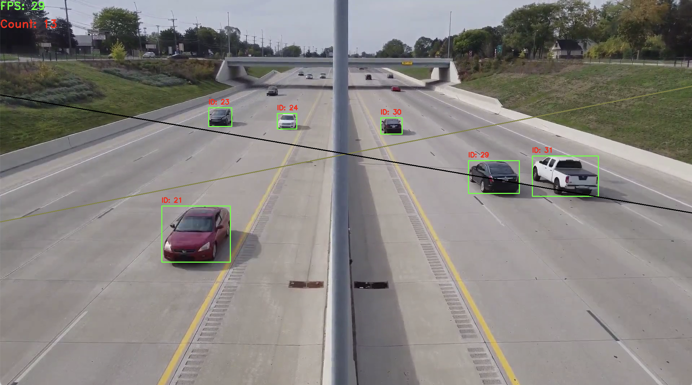

#  YOLOv8 Car Tracking

## Introduction
This repository contains a project which detects, tracks, and count the cars that are passing through a road.

## Techs
-  YOLOv8 object detection
-  Basic BYTETrack tracking
-  Kalman Filter position and speed prediction
-  Thread structure
-  OpenCV DNN backend

## Installation
- Make sure you had installed required libraries in your environment (opencv)
- Clone repository to your local machine
```
git clone https://github.com/mbkorkusuz/yolo_car_counting.git
```
- Navigate to the project directory
```bash
cd path/to/project_dir
```
- Compile and run the program
```bash
mkdir build && cd build
cmake ..
make
./tracker "path/to/video" "path/to/output"
```

## In run screenshot

